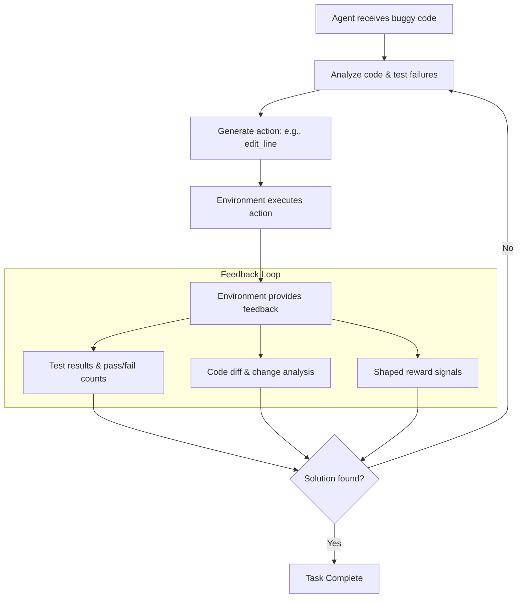

<div align="center">

# CodeFix-Env

**A reinforcement learning environment for training LLM-driven agents to autonomously debug, localize, and repair code through sandboxed execution and feedback-driven learning.**

<p align="center">
  <strong>Built for scalable agent evaluation on real-world software debugging tasks.</strong>
</p>

<p align="center">
  <!-- Red -->
  <a href="https://pytorch.org/">
    
  </a>

  <!-- Orange -->
  <a href="https://vllm.ai/">
    
  </a>

  <!-- Yellow -->
  <a href="https://huggingface.co/">
    
  </a>

  <!-- Green -->
  <a href="https://fastapi.tiangolo.com/">
    
  </a>

  <!-- Blue -->
  <a href="https://www.docker.com/">
    
  </a>

  <!-- Indigo -->
  <a href="https://github.com/">
    
  </a>

  <!-- Violet -->
  <a href="https://ollama.com/">
    
  </a>
</p>


<p align="center">
  <a href="https://www.python.org/downloads/"></a>
  <a href="https://pytorch.org/"></a>
  <a href="https://fastapi.tiangolo.com/"></a>
  <a href="https://gymnasium.farama.org/"></a>
  <a href="LICENSE"></a>
  <a href="tests/"></a>
  <a href="https://github.com/dhakarshailendra829/codefix-env"></a>
</p>

---

### 📖 Overview

CodeFix-Env is a **Gymnasium-compatible RL environment** that simulates real-world Python code debugging workflows. It enables researchers and engineers to:


| Goal | Description |
| :--- | :--- |
| **Train** | Large language models (LLMs) on code repair tasks. |
| **Evaluate** | AI agents on real debugging scenarios. |
| **Benchmark** | Code generation and reasoning capabilities. |
| **Build** | Automated debugging systems. |

**Compatible with:** Qwen, Llama, CodeLlama, DeepSeek, and other leading LLMs.

---

</div>

---

### 🔴 The Challenge
Training Large Language Models (LLMs) for code generation and autonomous repair requires more than static data. Effective learning requires:

*   **Authentic Scenarios:** Moving beyond synthetic examples to real-world debugging.
*   **Tight Feedback Loops:** Providing immediate test results and error logs.
*   **Measurable Progress:** Quantifiable metrics based on test pass rates.
*   **Secure Execution:** Sandboxed environments to prevent unsafe code execution.

### 🟢 The Solution: CodeFix-Env
CodeFix-Env is a specialized environment designed for RL agents and LLMs to master code repair through:

*   **Real-World Tasks:** 21 curated Python bugs ranging from logic errors to complex edge cases.
*   **Test-Driven Feedback:** Agents receive granular execution data after every action.
*   **Multi-Factor Rewards:** Reward signals based on test progress, code quality, and task completion.
*   **Isolated Execution:** Built-in sandboxing with timeout protection for safe evaluations.
*   **Structured Interaction:** Clean API for structured actions that LLMs can reliably generate.

### Workflow

---

## Key Features

** Task Library**
- 21 carefully designed debugging tasks
- 3 difficulty levels: Easy (8), Medium (8), Hard (5)
- Each task includes buggy code, solution, test cases, and hints
- Covers real Python patterns: loops, recursion, algorithms, decorators

** LLM Integration**
- Works with HuggingFace Transformers ecosystem
- Compatible with training frameworks: SFT, DPO, GRPO, PPO
- Pre-built support for Qwen, Llama, CodeLlama, DeepSeek models
- Structured JSON action interface for LLM control

** Performance**
- Multiprocessing-based sandbox with timeout enforcement
- Per-test execution isolation
- 197 unit tests with 83% code coverage
- Automated CI/CD pipeline (Python 3.10, 3.11, 3.12)

** Developer Friendly**
- Gymnasium standard interface
- Async client for high-performance training
- Sync wrapper for notebooks
- FastAPI HTTP server for remote access
- Complete type hints and documentation

---

## Installation

### Step 1: Clone Repository

```bash
git clone https://github.com/dhakarshailendra829/codefix-env.git
cd codefix-env
```
### Step 2: Create virual Environment
```bash
python3.11 -m venv .venv
source .venv/bin/activate (On mac)
.venv/Scripts/activate (On Windows)
```
### Step 3: Intall Package
#### For Basic Usage
```bash
pip install -e . 
```
---
#### For Developement
```bash
pip install -e ".[dev]"
```
---
#### For LLM training (includes transformers, TRL, datasets)
```bash
pip install -e ".[llm]"
```
---
#### For everything
```bash
pip install -e ".[dev,llm]"
```
### Step 4: Verify Installation
```bash
python -c "from codefix_env import CodeFixEnvironment; print(' Installation successful!')"
```
---
## Usage & Development Guide

### 1. Basic Environment Usage
```python
python << 'EOF'
from codefix_env import CodeFixEnvironment, CodeFixAction, ActionType

# Create environment
env = CodeFixEnvironment()

# Start episode with random easy task
obs = env.reset(difficulty="easy")
print(f"Task: {obs.task_id}")
print(f"Current Code:\n{obs.current_code}")

# Run tests to see failures
action = CodeFixAction(action_type=ActionType.RUN_TESTS)
result = env.step(action)
print(f"\nTest Results: {result.observation.tests_passed}/{result.observation.tests_total} passing")
print(f"Output:\n{result.observation.test_output}")

print(f"\nReward: {result.reward:.3f}")
print(f"Episode Done: {result.done}")
EOF
```

### 2. Testing & Quality Assurance
To run the full suite:
```bash
cd codefix-env
PYTHONPATH=src pytest tests/ -v --timeout=60
```

To run specific Test Suite
```bash
PYTHONPATH=src pytest tests/test_tasks.py::TestSolutionCorrectness -v
```

To check code standards:
```bash
ruff check src/ tests/ examples/
black --check src/ tests/ examples/
mypy src/codefix_env/ --ignore-missing-imports
```

### 3. API Server Deployment
```bash
cd codefix-env
uvicorn src.codefix_env.server.app:app --reload --port 8000
```
---
## Usage Examples

### 1. Core Debugging Workflow
A complete cycle from task initialization to final submission.

```python
from codefix_env import CodeFixEnvironment, CodeFixAction, ActionType

env = CodeFixEnvironment()
obs = env.reset(task_id="easy-001-missing-return")

# 1. Run tests to identify failures
result = env.step(CodeFixAction(action_type=ActionType.RUN_TESTS))
print(f"Tests: {result.observation.tests_passed}/{result.observation.tests_total} passing")

# 2. Apply a targeted fix
result = env.step(CodeFixAction(
    action_type=ActionType.EDIT_LINE,
    line_number=3,
    new_content="    return result"
))

# 3. Final Verification & Submission
result = env.step(CodeFixAction(action_type=ActionType.SUBMIT_FIX))
print(f"Status: {'Solved' if result.observation.all_tests_pass else 'Failed'}")
print(f"Final Reward: {result.reward:.3f}")
```

### 2. High-Level Task Management
Programmatically interact with the task database.

```python
from codefix_env import list_tasks, Difficulty, task_count

# Get environment stats
print(f"Total tasks by difficulty: {task_count()}")

# Bulk process specific difficulty levels
easy_tasks = list_tasks(difficulty=Difficulty.EASY)
for task in easy_tasks[:5]:
    print(f"Loading {task.id}: {task.title}")
```

---

## LLM Training & Integration

### Server-Client Architecture
Deploy the environment as a service to scale LLM evaluations across multiple agents.

```bash
# Start the API server
uvicorn src.codefix_env.server.app:app --port 8000
```

### Building Training Datasets
Export environment states into `.jsonl` formats for fine-tuning models like Llama or Qwen.

```python
import json
from codefix_env import CodeFixClient

async def collect_trajectories():
    async with CodeFixClient("http://localhost:8000") as client:
        obs = await client.reset(difficulty="medium")
        dataset_entry = {
            "instruction": f"Fix the following code: {obs.current_code}",
            "context": obs.test_output,
            "metadata": {"task_id": obs.task_id}
        }
        # Append to training_data.jsonl...
```

### Zero-Shot Inference (HuggingFace)
Connect an LLM directly to the environment loop.

```python
from transformers import pipeline
from codefix_env import CodeFixEnvironment

# Load a coding model
fixer = pipeline("text-generation", model="Qwen/Qwen2.5-Coder-7B")

env = CodeFixEnvironment()
obs = env.reset(difficulty="easy")

# Generate fix based on environment observation
prompt = f"Fix this Python code based on these errors: {obs.test_output}\nCode:\n{obs.current_code}"
suggestion = fixer(prompt)
```

---

## API Quick Reference


| Class / Method | Description |
| :--- | :--- |
| `CodeFixEnvironment` | Local execution engine for debugging tasks. |
| `CodeFixClient` | Async client for interacting with a remote server. |
| `env.step(action)` | Executes an `ActionType` (EDIT, RUN_TESTS, SUBMIT). |
| `Difficulty` | Enum: `EASY`, `MEDIUM`, `HARD`. |
| `BugCategory` | Categories: `SYNTAX`, `LOGIC`, `DATA_STRUCTURE`, `ALGORITHM`. |

---

## Development & CI/CD
Standard commands for maintaining the environment.

```bash
# Run full test suite with coverage
pytest tests/ -v --cov=src/codefix_env

# Static Analysis
ruff check src/   # Linting
black --check src/ # Formatting
mypy src/         # Type Checking
```
---

<div align="center">

# 🛠️ LLM Ecosystem & Infrastructure

### LLM Models

| Model | Description |
| :--- | :--- |
| 🟢 **Qwen 1.5B, 7B, 14B** | Alibaba's instruction models |
| 🟢 **Llama 2-7B-Chat** | Meta's foundation model |
| 🟢 **CodeLlama 7B, 13B, 34B** | Specialized for code |
| 🟢 **DeepSeek Coder 1.3B, 6.7B** | Chinese LLM for code |
| 🟢 **Mistral 7B** | Open-source efficient model |

<br/>

### ⚙️ Training Frameworks

| Framework | Method |
| :--- | :--- |
| 🟢 **SFT** | Supervised fine-tuning |
| 🟢 **DPO** | Direct preference optimization |
| 🟢 **GRPO** | Group relative policy optimization |
| 🟢 **PPO** | Proximal policy optimization |

<br/>

### 🏗️ Infrastructure

| Tool | Purpose |
| :--- | :--- |
| 🟢 **HuggingFace** | Model hub & training |
| 🟢 **vLLM** | Fast LLM serving |
| 🟢 **Ollama** | Local model deployment |
| 🟢 **Docker** | Containerization |
| 🟢 **GitHub Actions** | CI/CD |

</div>
